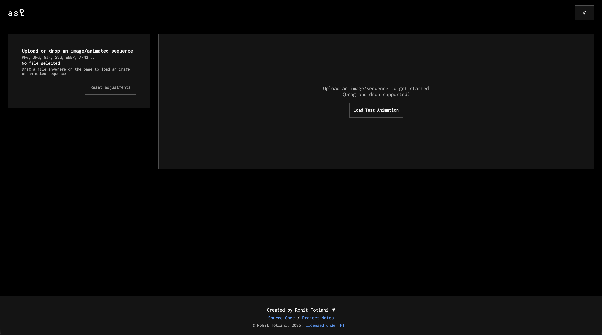
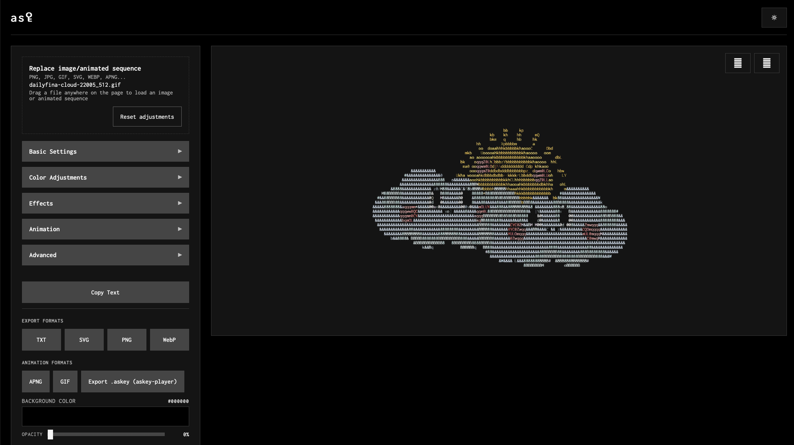

# asꄗ (askey)

<div align="center">
  
</div>

<h6 align="center">
    <a href="https://askey.vercel.app/">Visit Site</a>
</h6>

<div align="center">
  
  
  
  
  
  
  </a>
</div>

askey is a SvelteKit-powered app that turns any static or animated image into high-fidelity ASCII art. Upload GIFs, APNGs, PNGs, or JPEGs, tweak pro-level tone controls, and export the result to TXT, SVG, PNG, WebP, GIF, APNG, or JSON for the `askey-player.js` runtime.

You can export animations in a `.askey` format and play it everywhere in the web with the companion `askey-player.js` or run it in the terminal using the [cli tool](#askey-cli).

## ƒ Features

- Offline-ready PWA.
- Animated input support with adjustable frame limits, skip rates, and playback speed.
- Control over gradients, brightness/contrast and more...
- Background color picker.
- One-click exports to TXT, SVG, PNG, WebP, GIF, APNG, or JSON for animations.

## Screenshots

|                                      Init                                       |                                               ASCII Conversion                                               |
| :-----------------------------------------------------------------------------: | :----------------------------------------------------------------------------------------------------------: |
|  |  |

## 🖪 Running the project locally

```bash
# 1. Install dependencies
npm i

# 2. Start the dev server (http://localhost:5173)
npm run dev

# 3. Run the full type + lint suite (optional)
npm run check && npm run lint
```

The dev server hot-reloads when you edit files inside `src/`. Use `npm run check -- --watch` for incremental accessibility + type checks while iterating on components.

## 🛪 Deployment

1. `npm run check` – type and accessibility safety net.
2. `npm run lint` – ESLint + Prettier formatting.
3. `npm run build` – emits optimized client, server, and service worker bundles.
4. `npm run test` - Run test suites.
5. Deploy the adapter output (`.vercel/output`, `.netlify`, or `build`) to your host of choice.

## Roadmap

- [x] "Universal" export file for ASCII animations.
- [x] Offline support with service workers.
- [x] Rust terminal player for `.askey` files. (see: [askey-cli](#askey-cli))
- [x] Implement dithering algorithms options.
- [x] Fix render bug in certain animations with certain backgrounds/complex color combinations.
- [x] Increased test coverage.
- [ ] Animated WebP support.
- [ ] Video support maybe?
- [ ] Build a site to share and download asꄗ animations.

## ⛃ Tech stack

- [SvelteKit 2](https://kit.svelte.dev/) with Vite 7
- TypeScript 5 + ESLint 9 + Prettier 3
- Custom service worker for offline caching

## ☻ Contributing

1. Fork and clone the repo.
2. Create a feature branch off `main`.
3. Add or update tests for your change when possible.
4. Run `npm run lint && npm run check && npm run test`.
5. Open a PR with screenshots or GIFs for UI tweaks.

Have ideas for effects, exporters, or any other feats? Open an issue and describe the use case!

## ☛ License

This project is licensed under the MIT License - check [LICENSE](LICENSE) for details.
